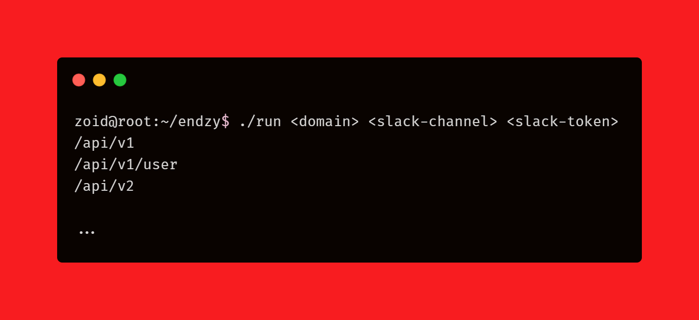

# endzy
Endpoint monitor tool notifies new endpoints using telegram

**Version 1.0**

### Install

**`$ chmod +x install ; ./install.sh`**

***
export TELEGRAM_API_TOKEN="apiToken"
export TELEGRAM_CHAT_ID="chat_id"
***

### Usage:

**`$ ./run yahoo.com`**

#### I hope you get a bounty with this technique.
****

**If you get a bounty please support by buying me a coffee**

 

